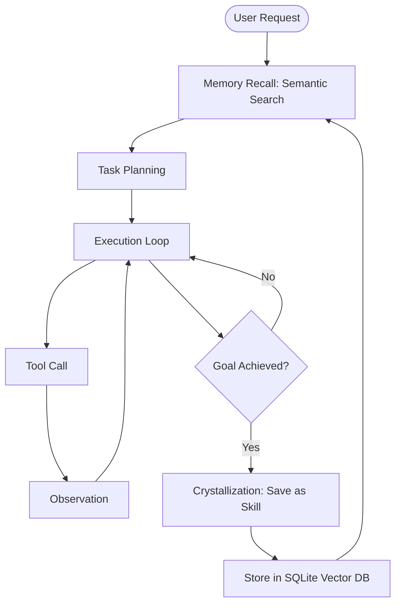

# Motion Harness: Technical Design Document

## 🎯 Vision
A self-evolving agent harness that treats every interaction as a learning opportunity. It doesn't just execute tasks; it builds a personal knowledge base of "how to solve X in this specific environment."

## 🧠 The Cognitive Architecture
The core of Motion Harness is the **Learning Loop**.

## 🛠️ Component Specifications

### 1. The Infrastructure Layer (Model Agnostic)
The harness does not bind to a specific model. It uses a **Provider Interface**.
- **Endpoint Resolution**:
  - `Local`: Configurable endpoints (e.g., Ollama `localhost:11434`, vLLM).
  - `Cloud`: Direct API integration (Anthropic, OpenAI, OpenRouter).
  - `Proxy`: Support for custom gateways for key rotation and auditing.
- **Configuration**: Handled via `providers.yaml` or `.env`, allowing hot-swapping of models mid-session.

### 2. The Memory Layer (Hybrid Retrieval)
To ensure flawless recall, we use a **Hybrid Search** mechanism.
- **Dense Retrieval**: `sqlite-vec` for semantic similarity (conceptual matches).
- **Sparse Retrieval**: SQLite `FTS5` for exact keyword/symbol matches.
- **Reranking**: A top-K retrieval filtered by a reranker to ensure only the most relevant context is injected.
- **Schema**:
  - `memories`: `(id, content, embedding, metadata, timestamp, type)`
  - `skills`: `(id, name, description, content, version)`

### 2. The MD Facilitator
A dedicated pipeline for bulk knowledge ingestion.
- **Process**: `Input MDs` $\rightarrow$ `Recursive Character Splitting` $\rightarrow$ `Embedding Model` $\rightarrow$ `SQLite Vector Store`.
- **Batching**: Uses asynchronous batching to handle large documentation sets without blocking the main agent loop.

### 3. The Skill Synthesis Engine
The "Aha!" moment. When a task is completed:
1. Agent reviews the transcript of the successful run.
2. Extracts the "Core Logic" (the critical steps).
3. Generates a `SKILL.md` using the **Caveman** format (concise, high-density information).
4. Saves the skill to the filesystem and the vector DB for future retrieval.

### 4. Ergonomic Optimizations
- **Caveman Protocol**: Internal prompts and tool outputs are passed through a "compressor" that removes polite fillers and redundancies, reducing token cost by ~30-50%. The compression is reversible: `CavemanCompressor.expand()` reconstructs natural language from compressed fragments using tracked tag maps.
- **Motion TUI**: A streaming-first terminal interface (built with Textual) that renders tool logs in real-time, displays task orchestration status, and allows the user to interrupt or steer the agent mid-execution.

## 🗺️ Implementation Phases
1. **Phase 1: Memory Foundation** (SQLite setup + Facilitator) — ✅ Complete
2. **Phase 2: Retrieval Integration** (Integrating semantic search into the system prompt) — ✅ Complete (sqlite-vec wired, numpy cosine fallback)
3. **Phase 3: The Learning Loop** (Implementing Skill Synthesis) — ✅ Complete (wired into MotionAgent.run)
4. **Phase 4: DX & Optimization** (Caveman mode & TUI) — ✅ Complete
   - Caveman bidirectional compression wired into MotionAgent.run
   - Professional TUI with 5 tabs (Chat, Tasks, Skills, Memory, Settings)
   - Runtime provider/model switching via Select dropdown
   - 4 native Textual themes (One Dark, Solarized Light, Nord, Dracula)
   - Ctrl+C cancels requests; Ctrl+Q quits; graceful shutdown
   - asyncio.Event-based task orchestration (no polling)
   - Graceful KeyboardInterrupt handling in REPL mode
