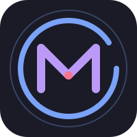
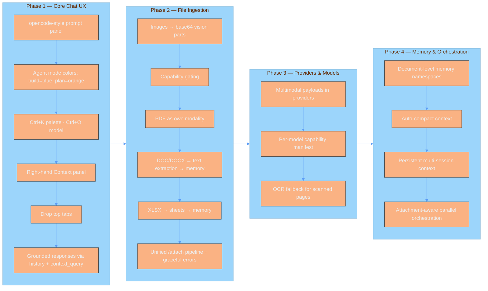

<p align="center">
  
</p>

<p align="center">
  <strong>The self-evolving AI agent harness for high-precision technical workflows.</strong>
</p>

<p align="center">
  <a href="#quick-start">Quick Start</a> · 
  <a href="docs/setup.md">Setup Guide</a> · 
  <a href="docs/architecture.md">Architecture</a> · 
  <a href="docs/skills.md">Skills Engine</a> · 
  <a href="docs/roadmap.md">Roadmap</a>
</p>

---

## 🌌 Overview

**Motion Harness** isn't just another agent wrapper; it is a cognitive infrastructure. While standard agents suffer from "context drift" and token inefficiency, Motion Harness implements a persistent **Cognitive Memory Loop**. 

It treats every successful task trajectory as a learning event, crystallizing experience into reusable skills and compressing communication to the absolute theoretical minimum.

### ⚡ The Core Edge

| Feature | The "Standard" Way | The Motion Way |
| :--- | :--- | :--- |
| **Memory** | Simple RAG / Vector Search | **Hybrid Recall** (Semantic + FTS5 Keyword) |
| **Tokens** | Natural Language Verbosity | **Caveman Compression** (Bidirectional Noise Reduction) |
| **Scaling** | Sequential Execution | **Parallel Orchestration** (CPU-aware concurrency) |
| **Growth** | Static Prompting | **Skill Synthesis** (Automatic procedural crystallization) |

---

## 🚀 Quick Start

Get the harness running in under 60 seconds.

### For complete beginners

**1. Install Python 3.10+** if you don't have it. On macOS: `brew install python@3.14`. On Linux: `sudo apt install python3 python3-venv`.

**2. Clone and install the harness:**
```bash
git clone <your-repo-url> motion-harness
cd motion-harness
chmod +x install.sh && ./install.sh
```

**3. Refresh your shell** so the `motion` command is available:
```bash
source ~/.config/fish/config.fish   # if you use fish
source ~/.zshrc                     # if you use zsh
source ~/.bashrc                    # if you use bash
```

**4. Configure your provider (API key):**
```bash
cp config.example.yml config.yml
```
Then open `config.yml` and set your API key. The easiest way is to create a `.env` file:
```bash
echo "OLLAMA_API_KEY=your-key-here" > .env
```
> **No need to add models one by one.** The harness ships with a built-in catalog of Anthropic, OpenAI, and Ollama Cloud models. Just add the API key and they're all available.

**5. Launch:**
```bash
motion
```

### CLI Usage

```
motion                                    # Launch TUI (default)
motion --provider ollama-cloud/glm-5.2    # TUI with specific provider/model
motion --chat                             # Legacy REPL mode
motion --list                             # List available providers/models
motion --test                             # Run Caveman compression test
```

*For detailed native installation and GPU configuration, see the [Setup Guide](docs/setup.md).*

---

## 🛠️ Deep Capabilities

### 🧠 Hybrid Cognitive Memory
Combines the nuance of vector embeddings with the precision of SQLite FTS5. Whether you need a "concept" or a "specific variable name," Motion finds it instantly.

### 🦴 Caveman Protocol
A bidirectional compression layer that strips conversational fluff. 
- **Input**: Natural language $\rightarrow$ Compressed tokens.
- **Output**: Compressed tokens $\rightarrow$ Natural language.
- **Result**: $\sim 50\%$ reduction in token overhead without loss of intent.

### 🎓 Self-Learning Synthesis
When a complex task is solved, the harness doesn't just forget. It analyzes the trajectory and "crystallizes" the steps into a `.md` skill, allowing the agent to execute the same complex workflow in the future with a single reference.

### 🎨 Pro-Grade TUI
A high-performance terminal interface built with `Textual`, designed for daily-driver clarity rather than an engineering dashboard.

**Focused single-chat view (opencode-style)**: no top tab bar. The screen is a top bar, the conversation canvas, a compact bottom composer, and a right-hand **Context panel**. Skills, settings, and model switching are all reachable via the command palette.

**Workspace regions**:
- **Conversation canvas** — markdown-first message cards with author/time headers and compact metadata; response code blocks carry theme-aware syntax highlighting.
- **Right Context panel** — the rolling session context and most recent turns, so you always see what the model is grounded against (`Ctrl+B` to toggle).
- **Composer** — a compact, opencode-style prompt: auto-growing (soft-wraps instead of scrolling), a thin left accent border colored by agent mode, prompt history (↑/↓), and an inline `agent · model · provider` meta row. Enter sends, Shift+Enter adds a newline.

**Agent mode colors**: `build` is **blue**, `plan` is **orange** (matches opencode).

**Grounded responses**: on every turn the harness passes the prior conversation (user + assistant) as history and the rolling session context as a memory-recall query, so the model references what was actually said instead of hallucinating.

**Theme token model**: semantic tokens (`$background`, `$surface`, `$panel`, `$border`, `$primary`, `$secondary`, `$accent`, `$text`, `$text-muted`, `$success`, `$warning`, `$error`) cascade through every widget via Textual's theme system.

**6 Native Themes**: OpenCode (default), One Dark, Solarized Light, Nord, Dracula, Omni Dark — cycle with `Ctrl+T`.

**Keyboard shortcuts**:
| Key | Action |
| :-- | :-- |
| `Ctrl+T` | Cycle theme |
| `Ctrl+B` | Toggle context panel |
| `Ctrl+O` | Switch model (provider → model) |
| `Ctrl+K` | Command palette (all commands) |
| `Ctrl+E` | Open external editor for the message |
| `F8` / `Ctrl+Shift+T` | Toggle interaction trace panel |
| `F9` / `Ctrl+Shift+C` | Copy last assistant response |
| `Tab` | Toggle agent (build / plan) |
| `?` | Show shortcuts overlay (generated from live bindings) |
| `Enter` (chat input) | Send message |
| `Shift+Enter` (chat input) | New line |
| `↑` / `↓` (chat input) | Prompt history |
| `/skill save <name>` | Save last reply as a skill |
| `Ctrl+C` / `Ctrl+X` | Cancel current request (does not quit) |
| `Ctrl+Q` | Quit (kills the process) |

**Dashboard integration**: one-click open to the admin dashboard at `https://localhost:7860/`.

### ⚠️ Known Limitations (v2 TUI)
- Trace persistence is per-session (not yet written to disk).
- Theme contrast validation is manual; the bundled themes are tuned for readability but very-low-contrast combinations are not auto-corrected.
- Shortcut help overlay (`?`) reflects MainScreen + ChatPane bindings; the Tasks/Skills/KB/Memory/Settings panes are defined but not mounted in the current focused-chat layout.
- Clipboard copy falls back to inserting the response into the input box when the terminal lacks clipboard support.
- File/document ingestion (image / PDF / DOCX / XLSX) is on the roadmap — see [Roadmap](docs/roadmap.md).

---

## 🗺️ Roadmap



Detailed tracking lives in [docs/roadmap.md](docs/roadmap.md).

---

## 🏗️ Architecture

The harness operates on a **High-Fidelity Cognitive Loop**:

`User Input` $\rightarrow$ `Hybrid Recall` $\rightarrow$ `Model Execution` $\rightarrow$ `Caveman Compression` $\rightarrow$ `TUI Output`

For a technical breakdown of the provider abstraction and the orchestrator, visit [Architecture Docs](docs/architecture.md).

---

## 🤝 Contributing

Motion Harness is in **Active Beta**. We welcome contributions to help us reach `v1.0.0`.

### 🛠️ Contribution Workflow
1. **Fork** the repository.
2. **Create a Feature Branch** from `beta` (not `main`).
3. **Submit a PR** targeting the `beta` branch.
4. **Wait for Review**: Changes will be merged into `beta` for testing before being curated into `main`.

### 🧪 Testing
Ensure all changes are validated against the integration suite:
```bash
pytest tests/test_integration.py
```

**Visual + TUI smoke checks** (headless, no terminal required):
```bash
# Parse/import sanity
python -c "from ui import tui; print('Import OK')"

# Headless TUI smoke: compose MainScreen, Ctrl+K palette, F8 trace toggle, ? overlay
python - <<'PY'
import asyncio, sys
from textual.app import App
from ui.tui import MainScreen, AppState, CommandPalette
from ui.themes import ThemeRegistry

class SmokeApp(App): pass
async def run():
    app = SmokeApp()
    for tid in ThemeRegistry.theme_ids():
        app.register_theme(ThemeRegistry.get_textual_theme(tid))
    async with app.run_test() as pilot:
        app.push_screen(MainScreen(AppState()))
        await pilot.pause()
        await pilot.press("ctrl+k"); await pilot.pause()      # open command palette
        assert isinstance(app.screen, CommandPalette)
        await pilot.press("escape"); await pilot.pause()      # close palette
        await pilot.press("f8"); await pilot.pause()          # toggle trace
        await pilot.press("f8"); await pilot.pause()
        await pilot.press("question_sign"); await pilot.pause()  # shortcuts overlay
        await pilot.press("escape"); await pilot.pause()
        sys.stderr.write("SMOKE OK\n")
asyncio.run(run())
PY
```

Checks cover: MainScreen compose, the `Ctrl+K` command palette, trace disclosure toggle (`F8`), and the shortcuts overlay (`?`/`Escape`).

For more details on our versioning and changelog, see [RELEASES.md](RELEASES.md).
