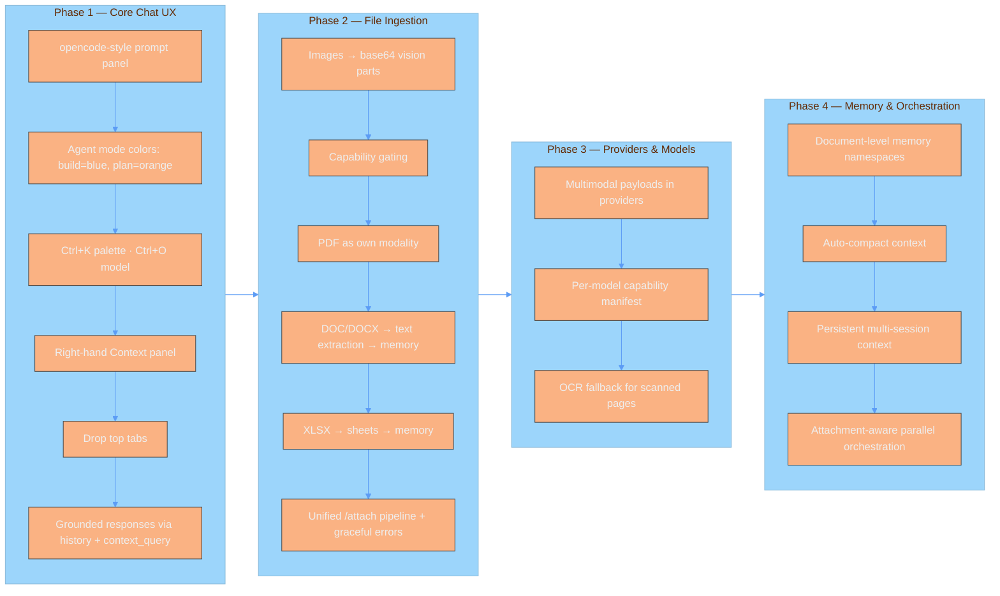

<p align="center">
  
</p>

<p align="center">
  <strong>The self-evolving AI agent harness for high-precision technical workflows.</strong>
</p>

<p align="center">
  <a href="#quick-start">Quick Start</a> · 
  <a href="docs/setup.md">Setup Guide</a> · 
  <a href="docs/architecture.md">Architecture</a> · 
  <a href="docs/skills.md">Skills Engine</a> · 
  <a href="docs/roadmap.md">Roadmap</a>
</p>

---

## 🌌 Overview

**Motion Harness** isn't just another agent wrapper; it is a cognitive infrastructure. While standard agents suffer from "context drift" and token inefficiency, Motion Harness implements a persistent **Cognitive Memory Loop**. 

It treats every successful task trajectory as a learning event, crystallizing experience into reusable skills.

### ⚡ The Core Edge

| Feature | The "Standard" Way | The Motion Way |
| :--- | :--- | :--- |
| **Memory** | Simple RAG / Vector Search | **Hybrid Recall** (Semantic + FTS5 Keyword) |
| **Tokens** | Natural Language Verbosity | **Caveman Compression** (Bidirectional Noise Reduction) |
| **Scaling** | Sequential Execution | **Parallel Orchestration** (CPU-aware concurrency) |
| **Growth** | Static Prompting | **Skill Synthesis** (Automatic procedural crystallization) |

---

## 🚀 Quick Start

Get the harness running in under 60 seconds.

### For complete beginners

**1. Install Python 3.11+** if you don't have it. On macOS: `brew install python@3.11`. On Linux: `sudo apt install python3 python3-venv`.

**2. Clone and install the harness:**
```bash
git clone https://github.com/MathiTz/motion-harness.git motion-harness
cd motion-harness
chmod +x install.sh && ./install.sh
```

**3. Refresh your shell** so the `motion` command is available:
```bash
source ~/.config/fish/config.fish   # if you use fish
source ~/.zshrc                     # if you use zsh
source ~/.bashrc                    # if you use bash
```

**4. Configure your provider (API key):**
```bash
cp config.example.yml config.yml
```
Then add your API key with the `auth` command (opencode-style):
```bash
motion auth login ollama-cloud   # prompts for your key, stored locally
motion auth login openai
motion auth login claude
motion auth list                 # see which providers have keys
motion auth logout ollama-cloud # remove a key
```
Keys are stored in `~/.config/motion-harness/auth.json` (0600 perms) — never in `config.yml`. You can also use env vars (`OLLAMA_API_KEY`, `OPENAI_API_KEY`, `ANTHROPIC_API_KEY`), including a `.env` file in the project root — it is loaded automatically on every launch path (`motion`, `motion --chat`, etc.), not just the legacy REPL. Lookup order: **auth store → env var → config.yml**.
> **No need to add models one by one.** The harness ships with a built-in catalog of Anthropic, OpenAI, and Ollama Cloud models. Just add the API key and they're all available — press `Ctrl+O` to browse/search them, or press `Ctrl+A` from anywhere in the TUI to jump straight to auth management. Providers without a stored key prompt for one inline instead of blocking you. A provider that isn't usable yet (no key, or a CLI delegate not on `PATH`) still shows in that list — grayed out, with the specific reason and fix — instead of silently disappearing.

**5. Launch:**
```bash
motion
```

### CLI Usage

```
motion                                    # Launch TUI (default)
motion --provider ollama-cloud/glm-5.2    # TUI with specific provider/model
motion --chat                             # Legacy REPL mode
motion --list                             # List available providers/models
motion --test                             # Run Caveman compression test
motion -p "review main.py"                # Headless one-shot: print the answer and exit
motion -p "..." --output-format json      # ...or a JSON result / stream-json events for scripts
motion auth login <provider>              # Store an API key
motion auth logout <provider>             # Remove a stored API key
motion auth list                          # List stored API keys
```

*For detailed native installation and GPU configuration, see the [Setup Guide](docs/setup.md).*

---

## 🛠️ Deep Capabilities

### 🧠 Hybrid Cognitive Memory
Combines the nuance of vector embeddings with the precision of SQLite FTS5. Whether you need a "concept" or a "specific variable name," Motion finds it instantly.

### 🦴 Caveman Protocol
An optional output filter that strips a fixed set of stock filler phrases ("Certainly!", "I hope this helps.", …) when a response is handed to another agent rather than to you. It is reversible (`CavemanCompressor.expand`) and is **not** applied to the model's input or to replies shown to you, so it does not meaningfully change token cost — treat it as a small utility, not a compression layer. (`motion --test` demonstrates it.)

### 🎓 Self-Learning Synthesis
When a complex task is solved, the harness doesn't just forget. It analyzes the trajectory and "crystallizes" the steps into a `.md` skill, allowing the agent to execute the same complex workflow in the future with a single reference.

### 🎨 Pro-Grade TUI
A high-performance terminal interface built with `Textual`, designed for daily-driver clarity rather than an engineering dashboard.

**Focused single-chat view (opencode-style)**: no top tab bar. The screen is a top bar, the conversation canvas, a compact bottom composer, and a right-hand **Context panel**. Skills, settings, and model switching are all reachable via the command palette.

**Workspace regions**:
- **Conversation canvas** — markdown-first message cards with author/time headers and compact metadata; response code blocks carry theme-aware syntax highlighting.
- **Right Context panel** — the rolling session context and most recent turns, so you always see what the model is grounded against (`Ctrl+B` to toggle).
- **Composer** — a compact, opencode-style prompt: auto-growing (soft-wraps instead of scrolling), a thick left accent border colored by agent mode, prompt history (↑/↓), and an inline `agent · model · provider` meta row. Enter sends, Shift+Enter adds a newline.

**Agent modes**: `build` (blue) has write access and creates/edits files; `plan` (orange, opencode-style) is read-only and produces a concrete written plan before you approve implementation. Toggle with `Tab` or via the command palette. Plan mode blocks `write_file`/`replace_in_file` with a soft guidance nudge so the model answers with a plan rather than asking you to repeat yourself.

**Grounded responses**: on every turn the harness passes the prior conversation (user + assistant) as history and the rolling session context as a memory-recall query, so the model references what was actually said instead of hallucinating. Long sessions are capped at the most recent 8 turns to keep the latest user message prominent.

**Theme token model**: semantic tokens (`$background`, `$surface`, `$panel`, `$border`, `$primary`, `$secondary`, `$accent`, `$text`, `$text-muted`, `$success`, `$warning`, `$error`) cascade through every widget via Textual's theme system.

**10 Native Themes**: OpenCode (default), One Dark, Solarized Light, Nord, Dracula, Omni Dark, and the full [Catppuccin](https://catppuccin.com/) family (Mocha, Macchiato, Frappé, Latte) — press `Ctrl+T` to open the theme menu (arrow keys preview live, `Enter` confirms, `Esc` reverts). Your choice is saved to `config.yml` (`default_theme`) and restored on the next launch.

**Interaction trace panel** (`F8`): a right-hand panel that shows the live tool loop as human-readable sentences, e.g. "about to run read_file on `main.py`", "write_file finished on `README.md`", or "read_file failed on `missing.txt`: file does not exist". Trace events include the affected path where applicable, plus diagnostics such as `step_cap_hit` (the tool loop hit its safety cap) and `loop_warning` (the same tool+path/command repeated 3x in a row). Unexpected turn failures are also logged with a full traceback to `motion.log` for debugging.

**Real token usage**: when the active provider reports usage, the session footer and per-turn metadata show real prompt/completion/total token counts instead of a character-based estimate; the estimate is used only as a fallback when a provider doesn't return usage data.

**Agent tools**: the agent can `list_files`, `glob_files`, `grep`, `read_file` (windowed: `offset`/`limit`), `read_image`, `web_fetch`, `web_search`, `todo_write`, `ask_user`, `use_skill`, `memory_save`/`memory_get` (persisted in the memory DB), `job_output`/`job_list`, `task` (read-only sub-agents) and any tool exposed by a connected MCP server — in both modes. In `build` mode it can also `write_file`, `replace_in_file`, `edit_files` (several replacements across files, all-or-nothing), `run_command`, `run_script`, `run_python`, `job_start`/`job_stop` and general-purpose sub-agents. `list_files`/`glob_files`/`grep` skip `.git`, virtualenvs, `node_modules` and anything in your `.gitignore`. Tool calls that target a path outside the workspace prompt you to **allow once**, **allow for the session**, or **deny**.

#### ⚡ Speed & responsiveness

- **Everything streams.** Answer text, model reasoning ("thinking") and tool progress appear as they are produced, including inside the tool loop. Providers with a native tool-calling API (OpenAI-compatible, Anthropic, Ollama) use it; models without one fall back to a streamed text protocol automatically.
- **Independent tool calls run in parallel.** When the model asks to read several files (or search and fetch) in one step, they execute concurrently in one round trip.
- **The UI never blocks.** Commands, network calls and file walks run off the event loop; `Esc` cancels immediately and kills the child process tree.
- **Live status line.** While a turn runs you see the phase (`thinking`, `running run_command`, `waiting for you`), elapsed time, step count, time-to-first-token, token count and the latest line of command output. Afterwards it shows the last turn's time. Reasoning collapses to `thought for 4.2s` (`F7` expands it).
- **Memory recall is off the critical path**: bounded by `recall_timeout` (default 2 s), skipped when memory is empty, embeddings are cached, and a failing recall never fails a turn.
- **Context stays small.** Old tool output is trimmed, oversized conversations drop the oldest tool exchanges, and history is summarized (`/compact`, or automatically at 60% of the model's window). Attachments are sent once with the message they belong to.
- **Resilient transport.** 429/5xx and connection errors retry with backoff (`max_retries`, default 3; honors `Retry-After`); the connect timeout is 10 s and the idle-read timeout defaults to 120 s (`timeout` per model).

#### 🧩 Sub-agents, background jobs, diffs and cost

- **Sub-agents.** The model can hand a self-contained task (`task`) to a sub-agent with its own fresh context; only its final report comes back, so broad exploration doesn't fill the main conversation. Read-only ("explore") sub-agents run in parallel, up to 3. General ones can edit and run commands but are sequential, cannot ask you questions or use your approval prompts, and can't spawn further sub-agents. They have a step cap and a timeout, and one `/undo` reverts their edits too.
- **Background jobs.** `job_start` runs a dev server or watcher in the background (same approvals and sandbox as commands); `job_output` returns only new lines and can wait for output; `job_stop` ends the whole process tree. `/jobs` lists them, `/jobs stop <id|all>` stops them, the status line shows how many are running, and they are stopped when the app exits.
- **Diffs.** Edits to existing files appear inline as a colored diff; `/diff` replays the last turn's edits in full and `/diff off` (or `show_diffs: false`) hides them.
- **Trajectory.** `/trajectory` shows every model step of the last turn: time, first-token latency, prompt/output tokens, and each tool call with its result size, followed by plain-language findings (prompt growth, the largest results, repeated calls, how much time was the model thinking). `/trajectory copy` puts it on the clipboard, `save` writes JSON under `.motion/trajectories/` (`save full` also stores the system prompt and every message sent to the model). `F10` (or Ctrl+K → Copy trace log) copies the whole trace panel as plain text. Sub-agent steps appear labelled `sub:<name>`.
- **Hooks.** Run your own commands around tool calls: a `pre_tool` hook can *block* a call (any non-zero exit; its output goes to the model as the reason; a hook that hangs or can't start blocks too, so a guard never silently turns off) and a `post_tool` hook can annotate the result (e.g. run a formatter). Each gets the call as JSON on stdin. Configure under `hooks:` in `config.yml`; they also guard sub-agents.
- **Stream integrity.** A response only counts as finished if the provider says so (`[DONE]`/`finish_reason`, Ollama's `done`, Anthropic's `message_stop`). A connection that just closes is reported as an incomplete reply (never returned as a short answer, and a half-received tool call is never run), and can trigger failover. A separate stall guard fails a turn that receives no real output for `stall_timeout` seconds (default 180, `0` = off) even if the provider keeps the connection alive with pings. A gateway that never sends a terminator can be accepted with `lenient_streams: true` in that model's options.
- **Native search.** File enumeration (`list_files`/`glob_files`/`grep`'s file selection) uses `fd` when it's on `PATH`, falling back to a pure-Python walk otherwise - purely an accelerant, never a source of different results: every candidate is still checked against the same ignore rules (including directory-only `.gitignore` patterns `fd` can't express directly). Real, measured difference: ~40ms → ~33ms on a few-thousand-file project, ~900ms → ~490ms on an 80k-file tree, where Python's own directory walk (not network or subprocess cost) was profiled as the actual bottleneck. `MOTION_DISABLE_NATIVE_SEARCH=1` forces the pure-Python path.
- **Use Claude Code or Codex directly (no separate API key).** If `claude` or `codex` is on `PATH` and already logged in — a subscription, not necessarily an API key — it appears in the model picker as "Claude Code (your login)" / "Codex (your login)". Selecting it delegates the whole turn to that CLI (`claude -p ...` / `codex exec ...`, exactly the pattern each vendor documents for scripting — never a reused OAuth token or client secret). Its own tools run outside this harness's sandbox, budget and hooks, and `/undo` does not cover its edits (a one-time notice says so). Claude Code reports its own real per-turn cost; Codex reports token counts but no dollar figure, since usage is under your subscription. Needs no config beyond being on `PATH` and logged in.
- **Prompt caching.** On Anthropic, the system prompt is split into a static part (tool instructions - identical for every step of a turn, and every turn of a session) and a dynamic part (recalled memory, git status, the date), so only the static part carries a cache breakpoint. A dynamic tail that changes every turn no longer invalidates the whole cached block; only Anthropic exposes this control today.
- **Failover.** List providers in `fallback_providers:` and when the current one is unavailable (5xx, rate limit, timeout, connection error, or a rejected key) the harness switches to the next usable one, tells you, and carries on with the work already gathered; the switch lasts for the session. Errors about the request itself (400/404/422) never trigger it, since any provider would reject those. Providers without an API key are skipped.
- **Budgets.** Cap a turn by model steps, tokens, cost or seconds (`budget:` in `config.yml`, `/budget steps 12`, or `--max-steps/--max-tokens/--max-cost/--max-seconds` headless). When a limit is reached the model gets one last tool-free step to answer with what it already gathered, and the reply ends with a "Stopped early" note. Sub-agent tokens count toward the lead's budget.
- **Cost.** Per-turn and session cost are computed from real token usage and the model's pricing (`input_mtok` / `output_mtok`, USD per million tokens; the catalog has them for every built-in Ollama Cloud, Claude and OpenAI model, set them in `config.yml` for anything else). Models without pricing show `cost n/a`; local models are free.

#### 🤖 Headless mode

`motion -p "prompt"` runs one turn with no UI, for scripts and CI. `--output-format text` (default) prints the answer; `json` prints one result object (answer, usage, cost, steps, timing and a per-step `trajectory`); `stream-json` prints events as they happen and ends with that result. `--plan` is read-only, `--workspace DIR` picks the directory, `--verbose` prints tool activity to stderr, `-p -` reads the prompt from stdin and `--stdin` appends piped input as context (`git diff | motion -p "review this" --stdin`). Nothing can be approved interactively, so risky commands are refused unless pre-approved in `permissions.commands.allow`. Exit codes: 0 ok, 1 the turn failed, 2 usage error, 130 interrupted.

#### 🔐 Safety & permissions

- **Risky commands ask first.** `rm -r/-f`, `sudo`, `git push/reset --hard/clean`, `curl | sh`, `chmod -R`, credential-file access and similar prompt for **allow once / for this session / deny**. Catastrophic commands (`rm -rf /`, `mkfs`, fork bombs) are always refused. Tune it in `config.yml` (`permissions.commands.allow|ask|deny`, shell-style globs).
- **Shell and Python run in an OS write sandbox.** On macOS (Seatbelt) and Linux (bubblewrap, if installed and usable) commands can only write inside the workspace, paths you approved, temp and tool-cache directories, so a command or script that slips past the pattern checks still cannot modify anything else. The harness's own auth store and `.env`, and the common credential stores (`~/.aws`, `~/.kube`, `~/.config/gh`, `~/.config/gcloud`, `~/.azure`, `~/.docker/config.json`, `~/.npmrc`, `~/.netrc`, `~/.gnupg`, `~/.pypirc`), are unreadable to commands, so an injected command can't read them and send them out. `~/.ssh` stays readable so `git push` works; hide it too with `sandbox_deny_read`. If you *want* the agent to run `aws`/`kubectl`, opt back in with `sandbox_allow_read: ["~/.aws"]`; `sandbox_network: deny` cuts the network entirely. Where no sandbox works (Windows, nested sandboxes) the status is reported at the start of a turn and only the policy checks apply. Reads and network are not restricted. `sandbox: off` in `config.yml` disables it.
- **Python is checked too.** `run_python`/`run_script` code that deletes files or spawns subprocesses asks first, like the shell equivalents; catastrophic patterns are refused even inside code.
- **Non-interactive contexts never auto-approve.** Background `/parallel` tasks refuse anything that would need a prompt.
- **Secrets stay out of child processes.** Provider API keys are stripped from the environment of commands the agent runs and of MCP servers.
- **Web content is untrusted.** `web_fetch`/`web_search`/MCP results are flagged as data, never instructions. `web_fetch` refuses loopback/private/link-local addresses (including via redirects) unless you approve.
- **Undo.** Every file the agent writes is snapshotted first; `/undo` restores the whole last turn (deleting files it created). Overwriting an existing file the agent hasn't read is refused.

#### 🗂️ Where state lives

Everything the harness writes into your project goes under one self-ignoring folder, `<workspace>/.motion/` (`tasks/`, `sessions/`, `skills/`); the harness's own log, memory DB and config stay in the install directory. Session transcripts (for `/resume`) are only written if you opted into interaction tracking.

**Model persistence**: switching models via `Ctrl+O` (or the startup provider picker) saves your choice as `last_provider` in `config.yml`, so the next `motion` launch reconnects to the same provider/model instead of resetting to the catalog default. An explicit `motion --provider ...` flag always overrides this for that one run and is not persisted.

**Resilient tool loop**: malformed tool calls and individual tool errors are treated as context rather than immediately stopping the agent. Only `Esc` (or an explicit `tool_error`/`Esc` stop signal) halts the loop, and the UI removes stale "Queued" notices as soon as a queued prompt starts running. Cancelling (`Esc` / `Ctrl+C`) stops the request and kills any command the agent is running.

**Keyboard shortcuts**:
| Key | Action |
| :-- | :-- |
| `Ctrl+T` | Open theme menu |
| `Ctrl+A` | Open auth management |
| `Ctrl+B` | Toggle context panel |
| `Ctrl+O` | Switch model (browse/search all models) |
| `Ctrl+R` (in model dialog) | Refresh the model list (scrapes latest Ollama Cloud models) |
| `Ctrl+N` (in model dialog) | Add a custom model |
| `Ctrl+K` | Command palette (all commands) |
| `Ctrl+E` | Open external editor for the message (runs in the background, no UI freeze) |
| `F7` | Toggle agent thinking (show intermediate tool-loop text inline) |
| `F8` / `Ctrl+Shift+T` | Toggle interaction trace panel |
| `F9` / `Ctrl+Shift+C` | Copy last assistant response |
| `Ctrl+Shift+K` | Copy last code block from the assistant's response |
| `Tab` | Toggle agent (build / plan) |
| `?` | Show shortcuts overlay (generated from live bindings) |
| `Enter` (chat input) | Send message |
| `Shift+Enter` (chat input) | New line |
| `↑` / `↓` (chat input) | Prompt history |
| `/skill list` · `show <name>` · `save <name>` · `delete <name>` | Manage reusable skills |
| `/compact` | Summarize the conversation to free context |
| `/undo` | Revert the file changes of the last turn |
| `/diff [on\|off]` | Show the last turn's edits / toggle inline diffs |
| `/jobs [stop <id\|all>]` | Background processes the agent started |
| `/trajectory [copy\|save [full]\|all]` | Per-step time, tokens and tool results of the last turn, with where the cost went |
| `/budget [steps N\|tokens N\|cost X\|seconds N\|off]` | Per-turn limits; a turn that reaches one is asked to answer with what it has |
| `/effort [low\|medium\|high\|off]` | Reasoning effort for models that support it (lower = faster and cheaper) |
| `/tracking [on\|off]` | Save session transcripts locally (asked once at first launch; this undoes "No thanks") |
| `/new` | Start a fresh conversation |
| `/resume [id]` | List saved sessions / reload one |
| `/todos` | Show the agent's task list |
| `/mcp` | Connected MCP servers and their tools |
| `/attach [path]` | Attach a file (or browse) to the next message |
| `/parallel a ; b` | Run sub-tasks on background workers; results appear in chat |
| `/auth list` | List stored API keys |
| `/auth login <provider>` | Store an API key for a provider |
| `/auth logout <provider>` | Remove a stored API key |
| `Esc` | Stop the current agent interaction |
| `Ctrl+Q` | Quit (kills the process) |

**CLI commands**:
| Command | Action |
| :-- | :-- |
| `motion` | Launch the TUI |
| `motion --chat` | Launch the REPL chat |
| `motion --list` | List providers/models |
| `motion --provider <id>` | Launch with a specific provider/model |
| `motion --test` | Run Caveman compression test |
| `motion auth login <provider>` | Store an API key (prompts, hidden input) |
| `motion auth logout <provider>` | Remove a stored API key |
| `motion auth list` | List which providers have keys |

### ⚠️ Known Limitations (v2 TUI)
- Trace persistence is per-session (not yet written to disk).
- Theme contrast validation is manual; the bundled themes are tuned for readability but very-low-contrast combinations are not auto-corrected.
- Clipboard copy falls back to inserting the response into the input box when the terminal lacks clipboard support.
- Conversation history sent to the model is capped at the most recent 8 turns; older context is condensed by `/compact` (or automatically near the context window).
- Attached PDFs/DOCX/XLSX are extracted to text (no native PDF modality yet); images are sent as real image parts to vision-capable models. See [Roadmap](docs/roadmap.md).
- Semantic memory search needs a real embedding model (a local Ollama model, or `embed_model` on an OpenAI-compatible provider); otherwise recall is keyword-only.

---

## 🗺️ Roadmap



Detailed tracking lives in [docs/roadmap.md](docs/roadmap.md).

---

## 🏗️ Architecture

The harness operates on a **High-Fidelity Cognitive Loop**:

`User Input` $\rightarrow$ `Hybrid Recall` $\rightarrow$ `Model Execution` $\rightarrow$ `Caveman Compression` $\rightarrow$ `TUI Output`

For a technical breakdown of the provider abstraction and the orchestrator, visit [Architecture Docs](docs/architecture.md).

---

## 🤝 Contributing

Motion Harness is in **Active Beta**. We welcome contributions to help us reach `v1.0.0`.

### 🛠️ Contribution Workflow
1. **Fork** the repository.
2. **Create a Feature Branch** from `beta` (not `main`).
3. **Submit a PR** targeting the `beta` branch.
4. **Wait for Review**: Changes will be merged into `beta` for testing before being curated into `main`.

### 🧪 Testing
Install the dev dependencies and run the whole suite (CI runs it on Python 3.11 and 3.14):
```bash
pip install -r requirements-dev.txt
PYTHONPATH=. pytest tests/
ruff check --select E9,F63,F7,F82 main.py core memory ui tests   # syntax errors / undefined names
```
The suite includes headless end-to-end TUI tests (streaming, approvals, `/undo`, `/resume`, cancellation) driven by a scripted provider — no API key or network needed.

**Visual + TUI smoke checks** (headless, no terminal required):
```bash
# Parse/import sanity
python -c "from ui import tui; print('Import OK')"

# Headless TUI smoke: compose MainScreen, Ctrl+K palette, F8 trace toggle, ? overlay
python - <<'PY'
import asyncio, sys
from textual.app import App
from ui.tui import MainScreen, AppState, CommandPalette
from ui.themes import ThemeRegistry

class SmokeApp(App): pass
async def run():
    app = SmokeApp()
    for tid in ThemeRegistry.theme_ids():
        app.register_theme(ThemeRegistry.get_textual_theme(tid))
    async with app.run_test() as pilot:
        app.push_screen(MainScreen(AppState()))
        await pilot.pause()
        await pilot.press("ctrl+k"); await pilot.pause()      # open command palette
        assert isinstance(app.screen, CommandPalette)
        await pilot.press("escape"); await pilot.pause()      # close palette
        await pilot.press("f8"); await pilot.pause()          # toggle trace
        await pilot.press("f8"); await pilot.pause()
        await pilot.press("question_sign"); await pilot.pause()  # shortcuts overlay
        await pilot.press("escape"); await pilot.pause()
        sys.stderr.write("SMOKE OK\n")
asyncio.run(run())
PY
```

Checks cover: MainScreen compose, the `Ctrl+K` command palette, trace disclosure toggle (`F8`), and the shortcuts overlay (`?`/`Escape`).

For more details on our versioning and changelog, see [RELEASES.md](RELEASES.md).
